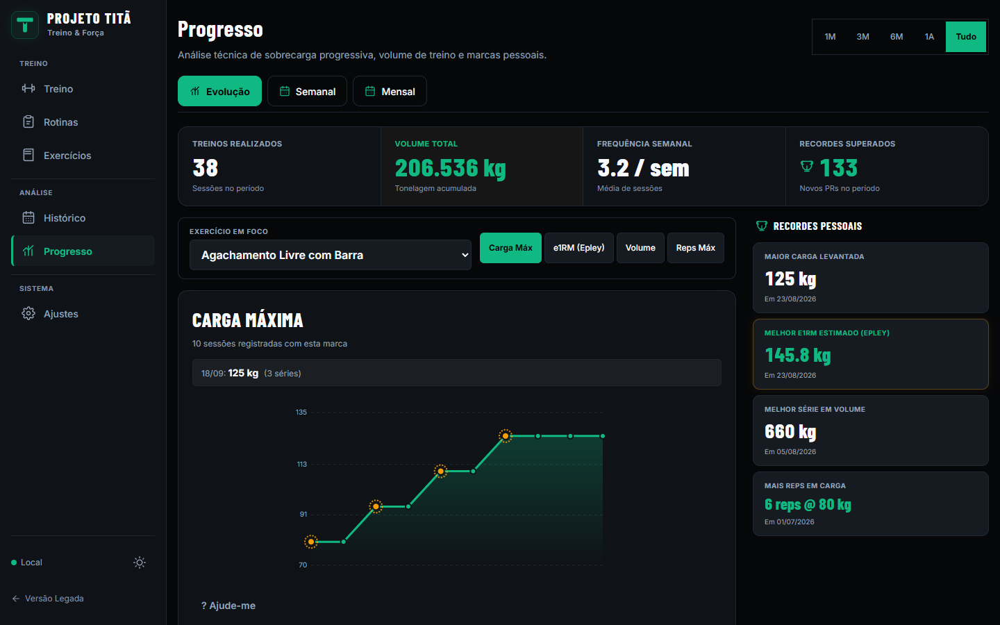
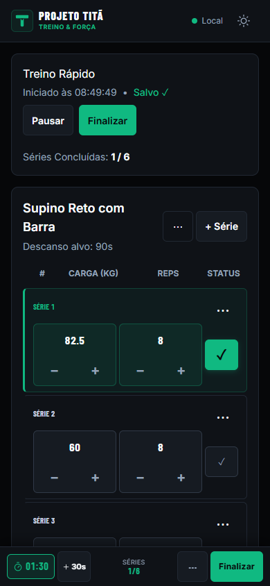
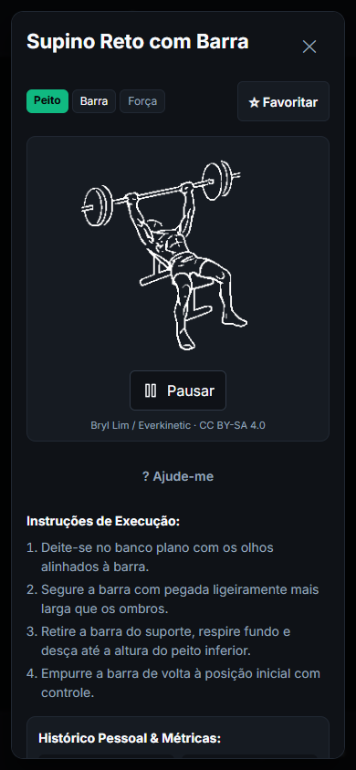
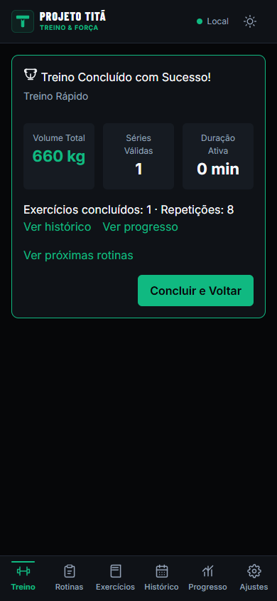

# Projeto Titã

**Treine, registre e acompanhe sua evolução, mesmo offline.** O Titã é um diário de treino local-first para Web/PWA, com rotinas, biblioteca de exercícios, histórico e progresso. [Abrir o app](https://tita.jorgetavares.dev) · [Release v1.0.0](https://github.com/thisisjorge/projeto-tita/releases/tag/v1.0.0)

## Visão geral

Uma sessão de treino costuma se perder entre anotações, planilhas e apps que exigem conta. O Titã reúne registro, planejamento e análise no próprio dispositivo, com uma interface para usar durante o treino e dados que você pode exportar.

## Screenshots



| Treino em andamento | Exercício animado | Resumo do treino |
| --- | --- | --- |
|  |  |  |

As [sete capturas](public/showcase/v1/manifest.json) foram feitas na produção em um perfil isolado com dados de demonstração. Elas mostram a interface real; não incluem dados de usuários.

## Principais recursos

- Registrar séries, carga, repetições e descanso; pausar, retomar e concluir o treino.
- Criar e reutilizar rotinas, importar e exportar programas.
- Consultar histórico, volume, frequência, recordes e gráficos de progresso.
- Receber sugestões locais de progressão, sem alterar séries automaticamente.
- Buscar 217 exercícios em PT-BR, inclusive pelos aliases em inglês; 215 têm GIFs derivados de mídia licenciada.
- Fazer backup e restauração dos seus dados em JSON.
- Usar ajuda com IA **opcional** via BYOK, com prévia e confirmação antes de cada envio externo. O treino funciona sem IA.

O projeto também oferece tema claro/escuro e navegação por teclado.

## Local-first

Sem conta obrigatória: treinos e rotinas ficam no IndexedDB do dispositivo. Depois do primeiro carregamento, a PWA funciona offline. Limpar os dados do navegador pode apagar registros locais; mantenha um backup.

## Stack

React, TypeScript, Vite, IndexedDB, Service Worker e Capacitor.

## Android

A [Web/PWA está publicada](https://tita.jorgetavares.dev). O APK Android anexado ao release usa **assinatura debug e é apenas para teste**; não é um release assinado para distribuição. iOS não foi validado em dispositivo físico. Veja [limites e validação da V1](docs/V1_RELEASE.md).

## Executar localmente

Requer Node.js 22+ e npm.

```bash
npm ci
npm run dev:web
```

Abra o endereço mostrado pelo Vite. Para conferir o build: `npm run build`. O CI roda lint, formatação, typecheck, unit/PBT, Chromium e WebKit. Consulte [contribuição](CONTRIBUTING.md) e [segurança](SECURITY.md).

## Open source e licenças

O código é [MIT](LICENSE). Ilustrações, GIFs e fontes têm licenças próprias; veja [créditos da mídia](public/media/ATTRIBUTION.md) e [avisos de terceiros](THIRD_PARTY_NOTICES.md). Os GIFs derivam de frames do `bryllim/workout-guide` sob CC BY-SA 4.0; a atribuição e a proveniência estão preservadas no repositório.

## Roadmap

O estado da V1 e os limites de validação estão em [V1_RELEASE.md](docs/V1_RELEASE.md). Próximos passos são acompanhados no [roadmap](ROADMAP.md), sem compromisso de prazo.
